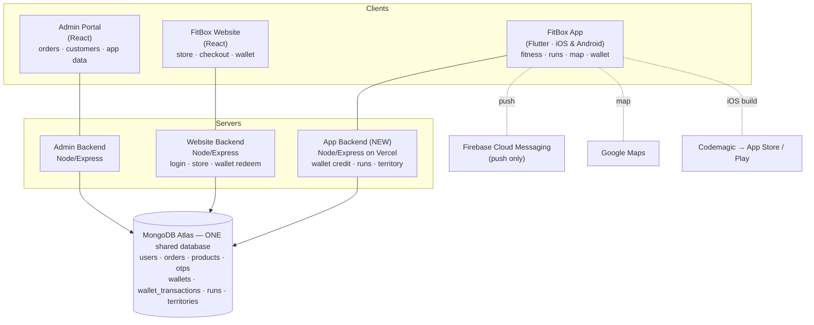

# FitBox Mobile App — Architecture

Cross-platform (iOS + Android) fitness app for FitBox Sports. It combines everyday
**fitness tracking** (steps, calories, distance, pace — the Strava / Nike Run Club /
Adidas Running baseline) with a **territory-capture running game** and a **shared points
wallet** that customers spend in the FitBox web store. The app, the website, and the
admin portal all share **one MongoDB Atlas database**, so the customer and their wallet
are a single source of truth everywhere.

---

## 1. System overview

**Key principle:** the mobile app never connects to the database directly. It talks to
the **app backend** over HTTPS; the backend holds the database connection. This keeps the
database credentials off the phone and out of the (public) app repo.

---

## 2. Components & responsibilities

| Part | Built with | Responsibility |
|---|---|---|
| **Mobile app** | Flutter (iOS + Android) | Fitness tracking UI, run tracking + map, wallet balance/history, territory, leaderboard, push. One codebase, both stores. |
| **App backend** *(new)* | Node/Express on Vercel | The app's own server. Awards wallet points (idempotently), stores runs & activity & territory, verifies the customer's login. Never in the app itself. |
| **Shared database** | MongoDB Atlas | Single source of truth: customers, orders, products, wallet, runs, territories. |
| **Website** | React + Node/Express | Existing store. Owns login + checkout. Shows the same wallet balance and redeems points at checkout. |
| **Admin portal** | React + Node/Express | Existing dashboard. New sections view app data (wallet transactions, later runs/territories). |

---

## 3. Feature set

### 3.1 Fitness tracking (the everyday base — Strava / NRC / Adidas style)
- **Daily steps** (pedometer) with a daily goal ring and progress.
- **Calories burned** (active + estimated) and **active minutes**.
- **Distance** covered (day / week) and **pace / speed** (current + average).
- **GPS run tracking**: live route on a Google Map, live stats, start/pause/stop.
- **Activity history**: list of past runs/workouts with route, distance, pace, calories, duration.
- **Goals & streaks**: daily-steps goal, weekly-distance goal, activity streaks, badges/achievements.
- **Weekly summary**: simple charts of steps/distance/calories over the week.

### 3.2 Territory-capture game
- A tracked run forms an **area** the runner can claim on the map.
- Overlapping claims resolve who owns contested ground; a **weekly leaderboard** ranks
  territory/activity and **resets weekly**.

### 3.3 Shared points wallet
- Activity (territory wins, milestones) **earns points**; balance is one number shared with the website.
- Customer **redeems points at website checkout** for a discount. (See §6.)

### 3.4 Notifications
- Push via FCM: workout reminders, "you've been overtaken", weekly results, wallet credits.

---

## 4. Authentication & identity
- The app reuses the **website's existing login** (email + OTP via Resend, and Google sign-in).
  No separate app account.
- A customer is identified by their unique record in the shared `users` collection
  (MongoDB `_id`). The website issues a signed **JWT**; the app stores it securely and sends
  it with every request. The app backend **verifies that JWT** (shared `JWT_SECRET`) before
  doing anything on the customer's behalf.
- **Firebase is used only for push notifications — never for login.**

---

## 5. Data model (shared collections)
Existing: `users`, `orders`, `products`, `otps`.
New (this project):
- `wallets` — `{ userId (unique), balance, updatedAt }`.
- `wallet_transactions` — append-only ledger: `{ userId, type: credit|debit, amount, balanceAfter, source, sourceId, idempotencyKey (unique), description, createdAt }`.
- `runs` — a tracked activity: `{ userId, startedAt, endedAt, distance, duration, pace, calories, steps, route (GeoJSON LineString), ... }`.
- `territories` — claimed areas: `{ userId, polygon (GeoJSON, 2dsphere index), area, weekOf, ... }`.
- (Daily step/calorie summaries can live on `runs`/a lightweight `activity` doc.)

All new collections use explicit collection names so app, website, and admin read/write the same documents.

---

## 6. Wallet design
- **Earn → credit → one balance → redeem.** Every balance change writes a `wallet_transactions`
  row and updates `wallets.balance` inside a **single MongoDB transaction**, so balance always
  equals the ledger sum.
- **Idempotency (hard requirement):** each credit/debit carries a unique `idempotencyKey`;
  a unique index makes a retried request a no-op instead of a double-credit.
- **Redeem:** website checkout applies a `debit` (`source: 'checkout_redeem'`, `sourceId: orderId`),
  points→discount rule agreed with Diwakar.
- **July note:** built and tested end-to-end with a manual/admin credit before real earning
  triggers exist, so the plumbing is locked while Diwakar (website/admin) is available.

---

## 7. Territory & geospatial
- Routes/areas stored as **GeoJSON** with a **2dsphere index**.
- Overlap detection via MongoDB **`$geoIntersects`**; precise area / intersection / subtraction
  via **Turf.js** in the app backend. Standard, proven, no special paid service.

---

## 8. Fitness data sources & device permissions
| Data | Source (cross-platform) | Permission / capability |
|---|---|---|
| GPS route, distance, pace | `geolocator` | Location (iOS: When/Always in Use; Android: `ACCESS_FINE_LOCATION` + foreground service) |
| Steps | `pedometer` + `health` | Motion (iOS `NSMotionUsageDescription`); Android `ACTIVITY_RECOGNITION` |
| Calories, distance, heart rate (optional) | `health` (Apple HealthKit / Android Health Connect) | HealthKit entitlement + `NSHealthShareUsageDescription`; Health Connect permissions |

Health data is **read on-device with explicit user consent**; it is sensitive and handled per store rules.

---

## 9. Security & privacy
- HTTPS everywhere; app backend verifies the signed JWT before any wallet/activity action.
- **No secrets in any repo** (all three are public) — keys/keystores/`.env`/service-account JSON are gitignored and live only in server/CI settings.
- Wallet integrity via single ledger + idempotency keys.
- Admin access stays separate from customer access.
- Health & location data: on-device, consented, disclosed in store privacy labels.

---

## 10. Tech stack (app)
Flutter (Dart). Planned packages — all actively maintained, cross-platform, and Codemagic-friendly (Dart/plugin, no manual Xcode steps):
`flutter_riverpod` (state, pending confirmation) · `go_router` (nav) · `dio` (HTTP) ·
`flutter_secure_storage` (JWT) · `geolocator` · `google_maps_flutter` · `pedometer` ·
`health` · `fl_chart` (charts) · `google_sign_in` · `firebase_core` + `firebase_messaging` (push) ·
`hive`/`shared_preferences` (local cache).

---

## 11. Cost
Essentially **no added monthly cost**: MongoDB Atlas (already paid, reused), Vercel (free), Firebase Cloud Messaging (free), Google Maps mobile (free tier), Codemagic (free tier). One-time store fees on publish only (Google Play one-off, Apple Developer yearly).

---

## 12. Delivery pipeline
Developed on Windows; tested on **Android** first (emulator + device). **iOS built entirely in
the cloud via Codemagic** (no Mac) → TestFlight on iPhone. Published to **both** stores together.
App + backend live in one repo (`backend/` subfolder) and deploy independently — Vercel builds
`backend/`, Codemagic builds the Flutter app from the root.

---

## 13. Repositories & workflow
- **App (this repo):** `Fitbox-41/FitBox-App` — Flutter at root, backend in `backend/`. Primary work on `main`.
- **Website:** `Fitbox-41/FitBox-Sports-Website` — work on branch `Gautam`, Diwakar reviews/merges.
- **Admin:** `Fitbox-41/Admin` — work on branch `Gautam`, Diwakar reviews/merges.
- Every push to the website/admin repos includes a handoff doc for a manual coder.

---

## 14. Roadmap
| When | Focus |
|---|---|
| **July** (with Diwakar) | Lock the shared wallet; build wallet end-to-end (earn → same balance → website redeem); add app-data section(s) to admin. All cross-system work while both sides can be coordinated. |
| **Weeks 1–2** (app frontend) | Basic frontend functioning to show the mentor: auth, home/dashboard with fitness stats, wallet screen, navigation; then connect to the live backend. |
| **August +** (app-only) | Full GPS run tracking, map, territory claim & capture, weekly winner + reset, health integration, push. |
| **Then** | Polish, full iOS pass via Codemagic/TestFlight, dual-store publish. |
